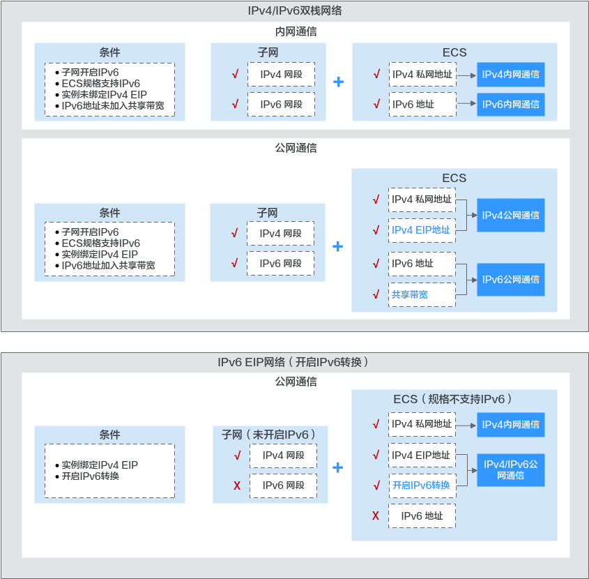

# IPv6概述

## 简介

弹性公网IP支持IPv4地址和IPv6地址，您可以申请一个全新的IPv6弹性公网IP，也可以通过IPv6转换功能将已有的IPv4弹性公网IP映射为公网IPv6地址。

开启IPv6转换后，将提供IPv4和IPv6弹性公网IP地址，原有IPv4业务可以快速为IPv6用户提供访问能力。

IPv4弹性公网IP收取费用，IPv6弹性公网IP当前暂不收费，后续将择时收费。

## IPv4/IPv6双栈网络应用场景

如果您的ECS规格支持IPv6网络，那么您可以使用IPv4/IPv6双栈网络，场景示例和资源规划如[表1](#table105590377292)所示。

**表 1**  IPv4/IPv6双栈网络的应用场景及资源规划

<table><thead align="left"><tr id="zh-cn_topic_0133505069_row1455915377291"><th class="cellrowborder" valign="top" width="10.489999999999998%" id="mcps1.2.6.1.1">
应用场景

</th>
<th class="cellrowborder" valign="top" width="17.59%" id="mcps1.2.6.1.2">
场景示例

</th>
<th class="cellrowborder" valign="top" width="40.38%" id="mcps1.2.6.1.3">
条件

</th>
<th class="cellrowborder" valign="top" width="10.71%" id="mcps1.2.6.1.4">
子网网段类型

</th>
<th class="cellrowborder" valign="top" width="20.830000000000002%" id="mcps1.2.6.1.5">
ECS

</th>
</tr>
</thead>
<tbody><tr id="row1623913713308"><td class="cellrowborder" valign="top" width="10.489999999999998%" headers="mcps1.2.6.1.1 ">
IPv4内网通信

</td>
<td class="cellrowborder" valign="top" width="17.59%" headers="mcps1.2.6.1.2 ">
在ECS上部署应用，需要与其他系统（比如数据库）之间使用<strong id="b3598102811426">IPV4</strong>进行内网互访。

</td>
<td class="cellrowborder" valign="top" width="40.38%" headers="mcps1.2.6.1.3 "><ul id="ul2222123744117"><li>VPC的子网未开启IPv6。</li><li>实例未绑定弹性公网IP。</li></ul>
</td>
<td class="cellrowborder" valign="top" width="10.71%" headers="mcps1.2.6.1.4 ">
IPv4网段

</td>
<td class="cellrowborder" valign="top" width="20.830000000000002%" headers="mcps1.2.6.1.5 ">
<strong id="b157256983916">IPv4私网地址：</strong>支持IPv4内网通信。

</td>
</tr>
<tr id="row335801012302"><td class="cellrowborder" valign="top" width="10.489999999999998%" headers="mcps1.2.6.1.1 ">
IPv4公网通信

</td>
<td class="cellrowborder" valign="top" width="17.59%" headers="mcps1.2.6.1.2 ">
在ECS上部署应用，需要与其他系统（比如数据库）之间使用<strong id="b68551133174214">IPV4</strong>进行公网互访。

</td>
<td class="cellrowborder" valign="top" width="40.38%" headers="mcps1.2.6.1.3 "><ul id="ul1917195612413"><li>VPC的子网未开启IPv6。</li><li>实例绑定弹性公网IP。</li></ul>
</td>
<td class="cellrowborder" valign="top" width="10.71%" headers="mcps1.2.6.1.4 ">
IPv4网段

</td>
<td class="cellrowborder" valign="top" width="20.830000000000002%" headers="mcps1.2.6.1.5 "><ul id="ul121841172514"><li><strong id="b1299612141059">IPv4私网地址：</strong>支持IPv4内网通信。</li><li><strong id="b13705131314398">IPv4公网地址：</strong>支持IPv4公网通信。</li></ul>
</td>
</tr>
<tr id="row19576052134216"><td class="cellrowborder" valign="top" width="10.489999999999998%" headers="mcps1.2.6.1.1 ">
IPv6内网通信

</td>
<td class="cellrowborder" valign="top" width="17.59%" headers="mcps1.2.6.1.2 ">
在ECS上部署应用，需要与其他系统（比如数据库）之间使用<strong id="b9866154016423">IPV6</strong>进行内网互访。

</td>
<td class="cellrowborder" valign="top" width="40.38%" headers="mcps1.2.6.1.3 "><ul id="ul588432014475"><li>VPC的子网开启IPv6。</li><li>创建ECS时，网络配置如下：<ul id="ul1757174118501"><li><strong id="b1989219481537">规格：</strong>选择支持IPv6网络的ECS规格。关于ECS哪些规格支持IPv6网络，请参见<a href="https://support.huaweicloud.com/productdesc-ecs/ecs_01_0019.html" target="_blank" rel="noopener noreferrer">《弹性云服务器用户指南》</a></li><li><strong id="b19667201414818">VPC和子网：</strong>选择已开启IPv6的子网及子网所属的VPC。</li><li>选择“<strong id="b291301913813">自动分配IPv6地址</strong>”。</li><li><strong id="b21401728282">共享带宽：</strong>暂不配置。</li></ul>
</li></ul>
</td>
<td class="cellrowborder" valign="top" width="10.71%" headers="mcps1.2.6.1.4 "><ul id="ul1075885351019"><li>IPv4网段</li><li>IPv6网段</li></ul>
</td>
<td class="cellrowborder" valign="top" width="20.830000000000002%" headers="mcps1.2.6.1.5 "><ul id="ul3341172910111"><li><strong id="b139801430133718">IPv4私网地址+IPv4 EIP：</strong>实例绑定IPv4 EIP，支持IPv4公网通信。</li><li><strong id="b23555252111">IPv4私网地址：</strong>实例不绑定IPv4 EIP，支持IPv4内网通信。</li><li><strong id="b9812814195">IPv6地址：</strong>IPv6地址不加入共享带宽，支持IPv6内网通信。</li></ul>
</td>
</tr>
<tr id="zh-cn_topic_0133505069_row14559183702918"><td class="cellrowborder" valign="top" width="10.489999999999998%" headers="mcps1.2.6.1.1 ">
IPv6公网通信

</td>
<td class="cellrowborder" valign="top" width="17.59%" headers="mcps1.2.6.1.2 ">
搭建IPv6网络，使ECS可以访问Internet上的<strong id="b4341449144214">IPv6</strong>服务。

</td>
<td class="cellrowborder" valign="top" width="40.38%" headers="mcps1.2.6.1.3 "><ul id="ul139761521161417"><li>VPC的子网开启IPv6。</li><li>创建ECS时，网络配置如下：<ul id="ul1942019095714"><li><strong id="b197762131413">规格：</strong>选择支持IPv6网络的ECS规格。关于ECS哪些规格支持IPv6网络，请参见<a href="https://support.huaweicloud.com/productdesc-ecs/ecs_01_0019.html" target="_blank" rel="noopener noreferrer">《弹性云服务器用户指南》</a></li><li><strong id="b19771921161410">VPC和子网：</strong>选择已开启IPv6的子网及子网所属的VPC。</li><li>选择“<strong id="b1197722161420">自动分配IPv6地址</strong>”。</li><li><strong id="b1797752121414">共享带宽：</strong>选择一个共享带宽。</li></ul>
</li></ul>

 说明： 

该场景的具体实现请参见<a href="https://support.huaweicloud.com/qs-vpc/qs_ipv6.html" target="_blank" rel="noopener noreferrer">搭建IPv6网络</a>。

</td>
<td class="cellrowborder" valign="top" width="10.71%" headers="mcps1.2.6.1.4 "><ul id="ul1358217161183"><li>IPv4网段</li><li>IPv6网段</li></ul>
</td>
<td class="cellrowborder" valign="top" width="20.830000000000002%" headers="mcps1.2.6.1.5 "><ul id="ul2841104394015"><li><strong id="b084194317408">IPv4私网地址+IPv4 EIP：</strong>实例绑定IPv4 EIP，支持IPv4公网通信。</li><li><strong id="b18411431404">IPv4私网地址：</strong>实例不绑定IPv4 EIP，支持IPv4内网通信。</li></ul>
<ul id="ul1522674132211"><li><strong id="b9226341162217">IPv6地址+共享带宽：</strong>同时支持IPv6公网通信和IPv6内网通信。</li></ul>
</td>
</tr>
</tbody>
</table>

使用IPv4/IPv6双栈网络请参考[IPv4/IPv6双栈网络](https://support.huaweicloud.com/usermanual-vpc/vpc_0002.html)。

## **IPv6转换**功能应用场景

如果您想使部署应用的ECS面向Internet客户端提供IPv6服务，但您的ECS规格不支持IPv6网络，或者您不想通过搭建IPv6网络来实现该需求，那么您可以通过弹性公网IP的IPv6转换功能快速实现该能力。场景示例和资源规划如[表2](#table104846201827)。

**表 2**  IPv6 EIP（开启IPv6转换）网络的应用场景及资源规划

<table><thead align="left"><tr id="zh-cn_topic_0133505069_row10563044205914"><th class="cellrowborder" valign="top" width="11.28%" id="mcps1.2.6.1.1">
应用场景

</th>
<th class="cellrowborder" valign="top" width="22.63%" id="mcps1.2.6.1.2">
场景示例

</th>
<th class="cellrowborder" valign="top" width="20.54%" id="mcps1.2.6.1.3">
条件

</th>
<th class="cellrowborder" valign="top" width="13.389999999999999%" id="mcps1.2.6.1.4">
子网网段类型

</th>
<th class="cellrowborder" valign="top" width="32.16%" id="mcps1.2.6.1.5">
ECS

</th>
</tr>
</thead>
<tbody><tr id="zh-cn_topic_0133505069_row1956304410594"><td class="cellrowborder" valign="top" width="11.28%" headers="mcps1.2.6.1.1 ">
IPv6公网通信

</td>
<td class="cellrowborder" valign="top" width="22.63%" headers="mcps1.2.6.1.2 ">
不搭建IPv6网络，使ECS为Internet上的客户端提供IPv6服务。

</td>
<td class="cellrowborder" valign="top" width="20.54%" headers="mcps1.2.6.1.3 "><ul id="ul184717564611"><li>实例绑定弹性公网IP。</li><li>开启IPv6转换。</li></ul>
</td>
<td class="cellrowborder" valign="top" width="13.389999999999999%" headers="mcps1.2.6.1.4 ">
IPv4网段

</td>
<td class="cellrowborder" valign="top" width="32.16%" headers="mcps1.2.6.1.5 "><ul id="ul19807846241"><li><strong id="b163617451972">IPv4私网地址：</strong>支持IPv4内网通信。</li><li><strong id="b1273120509711">IPv4 EIP地址（开启IPv6转换）：</strong>同时支持IPv4公网通信和IPv6公网通信。</li></ul>
</td>
</tr>
</tbody>
</table>

## IPv6网络应用场景及资源规划

**图 1**  IPv6网络应用场景及资源规划  

