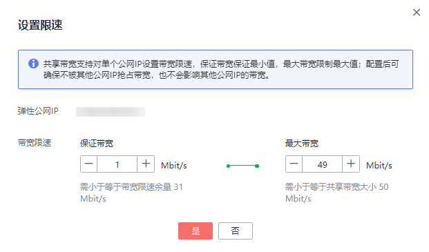

# 企业级QoS功能

## 简介

企业级QOS功能，可以针对共享带宽下的每个EIP，进行分别限速，每个EIP的流量大小会被限制在指定的带宽范围内，不会强占共享带宽的全部带宽，使得每个EIP的带宽大小可以相互不影响，提升共享带宽利用率。

该功能支持IPv4 EIP，也支持IPv6 EIP。

**保证带宽**

共享带宽下，分配给该EIP的最小带宽值。在共享带宽拥塞时，该EIP流量的最小带宽值可以得到保证。

**最大带宽**

共享带宽下，分配给该EIP的最大带宽值。在共享带宽空闲时，该EIP流量可以到达的最大带宽值，该值不会超过共享带宽的带宽大小。

## 应用场景

-   用户企业上云，需要根据各部门的运营情况随时调整各部门带宽资源配额，通过购买一个大的共享带宽，针对每个部门统一进行带宽分配，实现对整体带宽资源的合理分配。
-   多个业务网络高峰期不同时，通过对共享带宽下所有EIP分别进行带宽限速，可以保障带宽资源有效利用。
-   当部分业务被攻击时，占用出口带宽过大时，需要对被攻击的带宽进行限速，避免影响其他业务。

## 约束与限制

-   仅当共享带宽大小大于等于 50 Mbit/s时，才能开启企业级QoS功能。
-   共享带宽中对保证带宽的限制最大为2000Mbit/s。
-   每个共享带宽下最多支持5个EIP进行设置限速功能。
-   共享带宽下所有EIP进行设置限速后，保证带宽之和，不能超过共享带宽的总带宽大小。
-   当共享带宽大小变更时（包括带宽加油包到期过着修改带宽降配），可能会影响到共享带宽公网IP的保证带宽和最大带宽值，请提前确认对业务的影响。
-   共享带宽正在使用带宽加油包时，加油包到期时，带宽限速规则将停用。

## 基本操作

**开启企业级QoS功能**

-   申请共享带宽时开启，请参考[申请共享带宽](申请共享带宽.md)申请共享带宽，勾选“企业级QoS功能”。

    **图 1**  开启企业级QoS功能  
    

-   已存在的共享带宽，可在共享带宽列表操作列单击“更多 \> 开启企业级QoS功能”。

    **图 2**  开启企业级QoS功能  
    

**设置限速**

1.  登录管理控制台。
2.  在管理控制台左上角单击，选择区域和项目。
3.  在系统首页，选择“网络 \> 弹性公网IP”。
4.  在左侧导航栏，选择“弹性公网IP和带宽 \> 共享带宽”。
5.  在共享带宽列表页，单击待设置限速共享带宽的名称，进入共享带宽详情页。
6.  在弹性公网IP或IPv6网卡页签下，单击待设置限速的弹性公网IP或IPv6双栈网卡操作列的“设置限速”。

    **图 3**  设置限速  
    

7.  设置“保证带宽”与“最大带宽”值。

