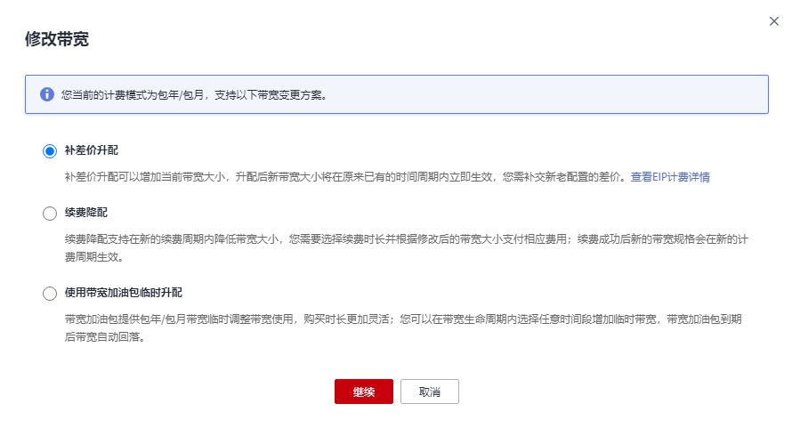
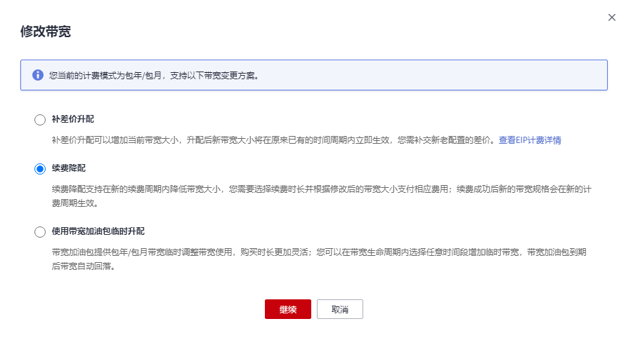
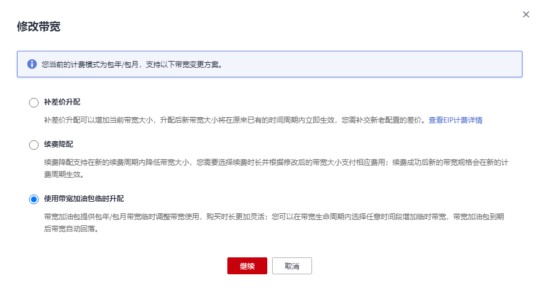
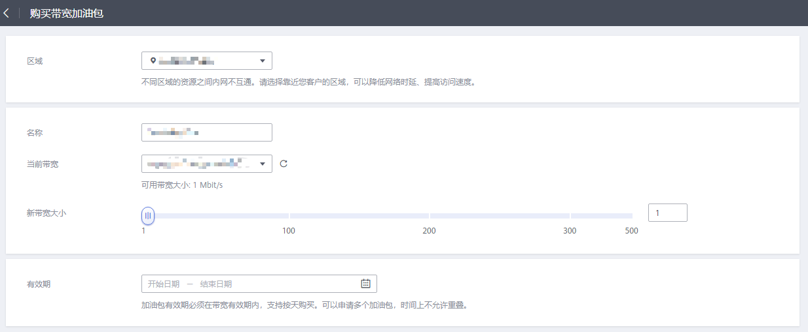

# 修改共享带宽

## 操作场景

您可以根据需要修改共享带宽的名称、计费方式和带宽大小。

-   按需计费的共享带宽，修改成功后立即生效，请参见[修改共享带宽（按需计费）](#zh-cn_topic_0118498940_section67201052194510)。
-   包年/包月的共享带宽，包括以下模式：
    -   [补差价升配（包年/包月）](#zh-cn_topic_0118498940_section1511155213514)：修改成功后立即生效
    -   [续费降配（包年/包月）](#zh-cn_topic_0118498940_section16487104713710)：修改成功后在新的计费周期生效
    -   [使用带宽加油包临时升配（包年/包月）](#zh-cn_topic_0118498940_section15661410789)：购买后立即生效

## 修改共享带宽（按需计费）

1.  登录管理控制台。

1.  在管理控制台左上角单击，选择区域和项目。
2.  在系统首页，选择“网络 \> 弹性公网IP”。
3.  在左侧导航栏，选择“弹性公网IP和带宽 \> 共享带宽”。
4.  在共享带宽列表中找到您想修改的共享带宽，在“操作”列单击“修改带宽”，修改共享带宽的参数。
5.  单击“下一步”。
6.  单击“提交”，完成修改。

    修改完成后，新的带宽规格立即生效。

## 补差价升配（包年/包月）

1.  登录管理控制台。

1.  在管理控制台左上角单击，选择区域和项目。
2.  在系统首页，选择“网络 \> 弹性公网IP”。
3.  在左侧导航栏，选择“弹性公网IP和带宽 \> 共享带宽”。
4.  在共享带宽列表中找到您想修改的共享带宽，在“操作”列单击“修改带宽”。
5.  选择“补差价升配”。

    **图 1**  补差价升配  
    

6.  在“修改带宽”页面的“变更规格”区域，修改共享带宽的“带宽名称”和“带宽大小”。

    **图 2**  变更规格  
    

7.  单击“下一步”。
8.  单击“提交”，完成修改。

    修改完成后，新的带宽规格立即生效。

## 续费降配（包年/包月）

1.  登录管理控制台。

1.  在管理控制台左上角单击，选择区域和项目。
2.  在系统首页，选择“网络 \> 弹性公网IP”。
3.  在左侧导航栏，选择“弹性公网IP和带宽 \> 共享带宽”。
4.  在共享带宽列表中找到您想修改的共享带宽，在“操作”列单击“修改带宽”。
5.  选择“续费降配”。

    **图 3**  续费降配  
    

6.  在“修改带宽”页面的“变更规格”区域，修改共享带宽的“带宽名称”和“带宽大小”。

    **图 4**  变更规格  
    

7.  单击“下一步”。
8.  单击“提交”，完成修改。

    修改完成后，新的带宽规格将在当前计费周期结束后生效。

## 使用带宽加油包临时升配（包年/包月）

1.  登录管理控制台。

1.  在管理控制台左上角单击，选择区域和项目。
2.  在系统首页，选择“网络 \> 弹性公网IP”。
3.  在左侧导航栏，选择“弹性公网IP和带宽 \> 共享带宽”。
4.  在共享带宽列表中找到您想修改的共享带宽，在“操作”列单击“修改带宽”。
5.  选择“使用带宽加油包临时升配”。

    **图 5**  使用带宽加油包临时升配  
    

6.  跳转至“购买带宽加油包”页面，根据需要临时升配的带宽以及周期填写带宽加油包相关参数，详细内容请参见[购买带宽加油包](购买带宽加油包.md#bandwidthpk_0003)。

    **图 6**  购买带宽加油包  
    

7.  单击“立即购买”并完成支付。

    带宽加油包购买成功后立即生效，其带宽将在有效期内与共享带宽叠加使用，待有效期结束后失效。

