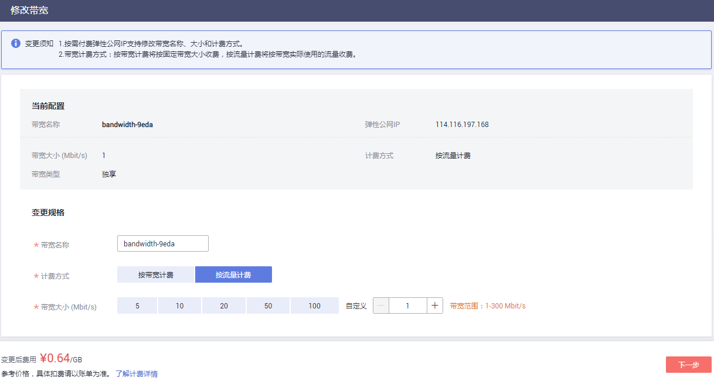
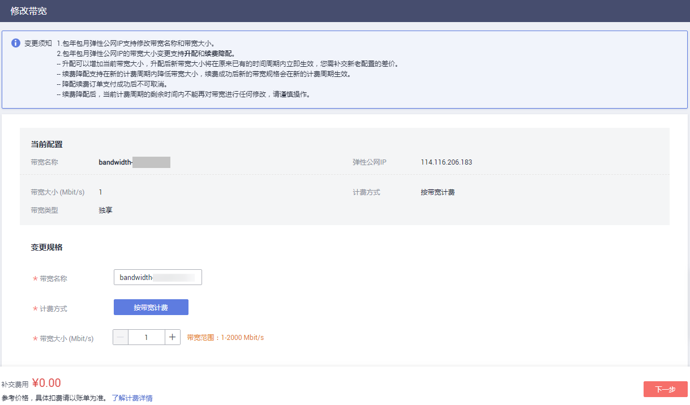
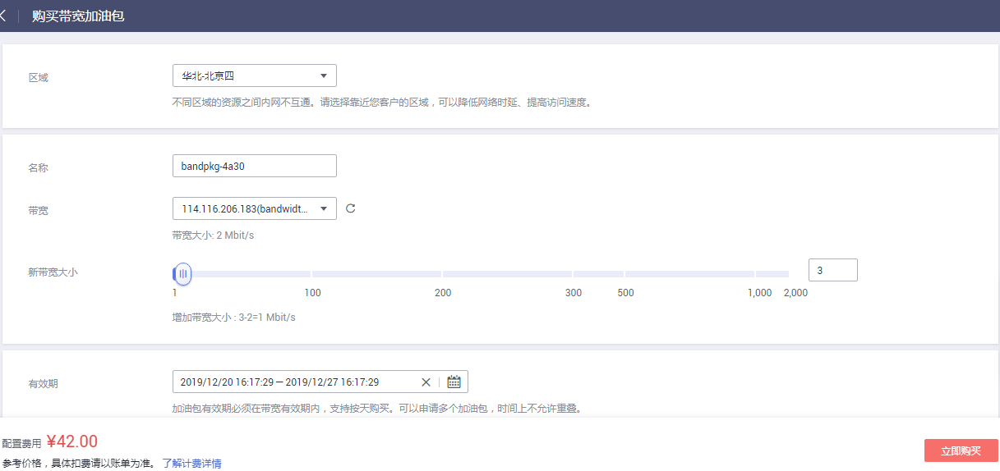

# 修改弹性公网IP独享带宽大小

## 操作场景

当您购买弹性公网IP时，无论是哪种计费模式，只要没有加入共享带宽，那么您的弹性公网IP使用的是独享带宽。

本章节指导用户修改独享带宽大小，你可以增加或者降低带宽大小。

当您修改带宽大小时，不同计费方式的带宽收费和生效时间不同，请您参考[表1](#zh-cn_topic_0000001240837046_zh-cn_topic_0118498819_table117061129519)了解详情，适用于独享带宽和共享带宽两种情况。

**表 1**  修改带宽大小的费用情况

<table><thead align="left"><tr id="zh-cn_topic_0000001240837046_eip_0012_zh-cn_topic_0118498819_row2070710212517"><th class="cellrowborder" valign="top" width="14.12141214121412%" id="mcps1.2.5.1.1">
计费模式

</th>
<th class="cellrowborder" valign="top" width="12.461246124612462%" id="mcps1.2.5.1.2">
计费方式

</th>
<th class="cellrowborder" valign="top" width="18.771877187718772%" id="mcps1.2.5.1.3">
变更操作

</th>
<th class="cellrowborder" valign="top" width="54.64546454645465%" id="mcps1.2.5.1.4">
对费用的影响

</th>
</tr>
</thead>
<tbody><tr id="zh-cn_topic_0000001240837046_row599095714407"><td class="cellrowborder" rowspan="3" valign="top" width="14.12141214121412%" headers="mcps1.2.5.1.1 ">
包年/包月

</td>
<td class="cellrowborder" valign="top" width="12.461246124612462%" headers="mcps1.2.5.1.2 ">
按带宽计费

</td>
<td class="cellrowborder" valign="top" width="18.771877187718772%" headers="mcps1.2.5.1.3 ">
增加带宽大小（补差价升配）

</td>
<td class="cellrowborder" valign="top" width="54.64546454645465%" headers="mcps1.2.5.1.4 ">
升配后，新带宽大小将在原来已有的时间周期内立即生效。

您需要按照与原带宽的价格差，结合使用周期内的剩余时间，补齐差价。

例如：（以下价格仅作示例，实际价格以控制台显示为准）

客户于2018/11/1 购买了1Mbit/s的带宽，购买时长为1个月，此时价格为18.4元/月，客户使用余额支付18.4元，实付金额为18.4元。

客户在2018/11/24 将带宽升级为5Mbit/s，价格为92元/月。

这时，剩余天数为 30 - 24 = 6天，升配费用=92 / 30 * 6 - 18.4 / 30 * 6 = 14.72元。

了解更多变更资源计费信息，请参见<a href="https://support.huaweicloud.com/usermanual-billing/renewals_topic_60000001.html" target="_blank" rel="noopener noreferrer">变更资源费用说明</a>。

</td>
</tr>
<tr id="zh-cn_topic_0000001240837046_row1797215914408"><td class="cellrowborder" valign="top" headers="mcps1.2.5.1.1 ">
按带宽计费

</td>
<td class="cellrowborder" valign="top" headers="mcps1.2.5.1.2 ">
降低带宽大小（续费降配）

</td>
<td class="cellrowborder" valign="top" headers="mcps1.2.5.1.3 ">
降配后，新带宽大小不会立即生效。

你需要选择续费时长并根据新的带宽大小进行续费，续费成功后，新带宽大小在新的计费周期内生效。<ul id="zh-cn_topic_0000001240837046_eip_0012_zh-cn_topic_0118498819_ul178551434171416"><li>续费降配订单在资源未生效前支持退订。</li><li>续费降配后，当前计费周期的剩余时间内不能再对带宽进行任何修改，请谨慎操作。</li></ul>

</td>
</tr>
<tr id="zh-cn_topic_0000001240837046_row173115585423"><td class="cellrowborder" valign="top" headers="mcps1.2.5.1.1 ">
按带宽计费

</td>
<td class="cellrowborder" valign="top" headers="mcps1.2.5.1.2 ">
临时增加带宽大小（使用带宽加油包临时升配）

</td>
<td class="cellrowborder" valign="top" headers="mcps1.2.5.1.3 ">
带宽加油包单独计费，您可以在带宽的使用周期内选择任意时间段使用带宽加油包临时增加带宽，带宽加油包到期后带宽自动回落。

</td>
</tr>
<tr id="zh-cn_topic_0000001240837046_eip_0012_row129737166211"><td class="cellrowborder" rowspan="2" valign="top" width="14.12141214121412%" headers="mcps1.2.5.1.1 ">
按需计费

</td>
<td class="cellrowborder" valign="top" width="12.461246124612462%" headers="mcps1.2.5.1.2 ">
按带宽计费

</td>
<td class="cellrowborder" valign="top" width="18.771877187718772%" headers="mcps1.2.5.1.3 ">
增加/降低带宽大小

</td>
<td class="cellrowborder" valign="top" width="54.64546454645465%" headers="mcps1.2.5.1.4 ">
增加/降低带宽大小后，新的带宽大小和计费方式将立即生效。

</td>
</tr>
<tr id="zh-cn_topic_0000001240837046_eip_0012_zh-cn_topic_0118498819_row6707727518"><td class="cellrowborder" valign="top" headers="mcps1.2.5.1.1 ">
按流量计费

</td>
<td class="cellrowborder" valign="top" headers="mcps1.2.5.1.2 ">
增加/降低带宽大小

</td>
<td class="cellrowborder" valign="top" headers="mcps1.2.5.1.3 ">
增加/降低带宽大小后，新的带宽大小将立即生效。

按流量计费的EIP，带宽仅做限速使用，带宽大小不影响实际费用。

</td>
</tr>
</tbody>
</table>

## 操作步骤

1.  登录管理控制台。
2.  在管理控制台左上角单击，选择区域和项目。
3.  在系统首页，选择“网络 \> 弹性公网IP”。
4.  在待修改弹性公网IP所在行的“操作”列，选择“修改带宽”。
    -   按需带宽将直接进入“修改带宽”页面。
    -   包年包月带宽可根据需求选择以下任一种带宽变更方案，并单击“继续”。
        -   补差价升配
        -   续费降配
        -   使用带宽加油包临时升配

5.  根据界面提示修改带宽大小。

    **图 1**  修改按需带宽大小  
    

    **图 2**  修改包年包月带宽大小  
    

    **图 3**  使用带宽加油包临时升配  
    

    > **说明：** 
    >-   同时您也可以修改带宽名称和按需带宽的计费方式。
    >-   了解更多带宽加油包信息，请参见[带宽加油包简介](带宽加油包简介.md)。

6.  单击“下一步”。
7.  单击“提交”，完成修改。

您还可以同时勾选多个弹性公网IP，单击列表上方的“修改带宽”，批量修改多个弹性公网IP的带宽。批量修改操作仅支持按需且独享的带宽。

## 相关操作

[带宽如何扩大至300Mbit/s以上？](https://support.huaweicloud.com/eip_faq/faq_bandwidth_0015.html)

