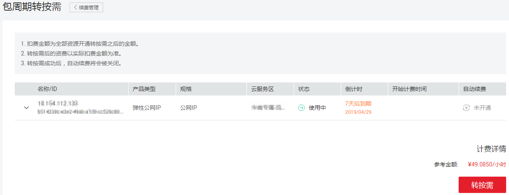
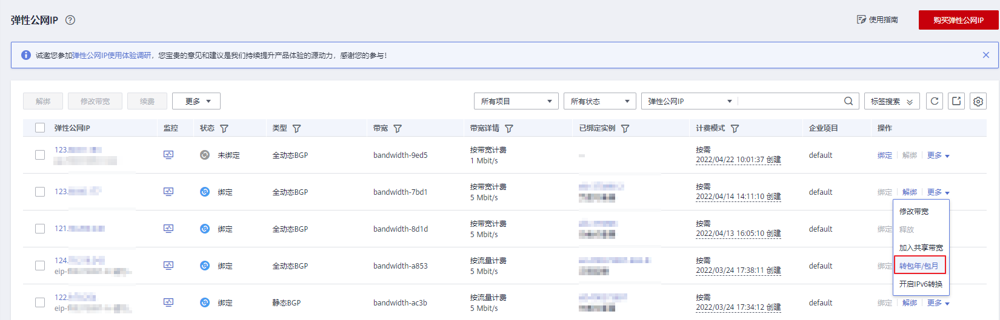
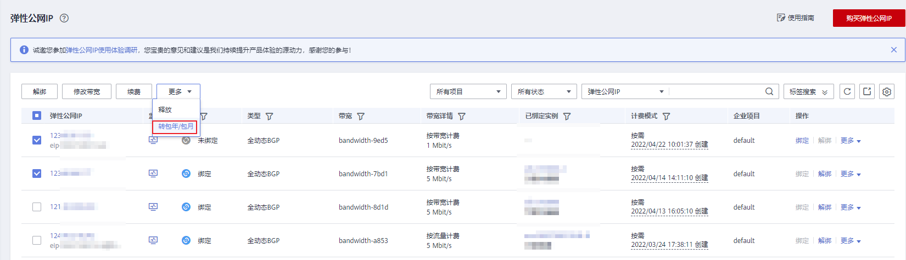
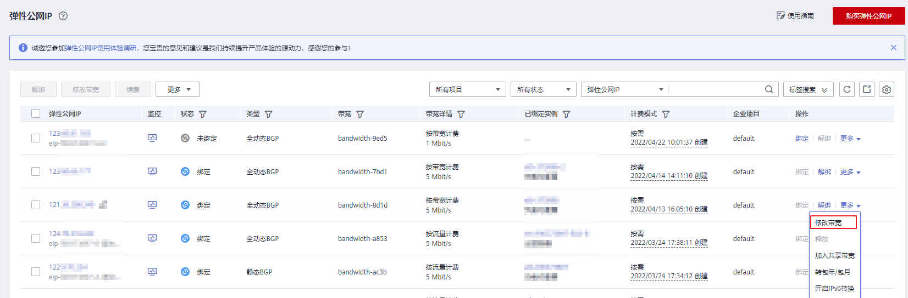

# 变更弹性公网IP计费方式

## 操作场景

弹性公网IP提供多种计费方式供您灵活选择，使用期间，不同的计费方式支持切换。

本章节指导用户变更弹性公网IP的计费方式，不同计费方式变更场景的详细说明如[表1](#table173411930182010)所示。

**表 1**  弹性公网IP计费方式变更说明

<table><thead align="left"><tr id="zh-cn_topic_0000001240837046_row657341645219"><th class="cellrowborder" valign="top" width="37.769999999999996%" id="mcps1.2.3.1.1">
计费方式变更场景

</th>
<th class="cellrowborder" valign="top" width="62.23%" id="mcps1.2.3.1.2">
计费变更说明

</th>
</tr>
</thead>
<tbody><tr id="zh-cn_topic_0000001240837046_row9573151655214"><td class="cellrowborder" valign="top" width="37.769999999999996%" headers="mcps1.2.3.1.1 ">
包年/包月→按需计费

</td>
<td class="cellrowborder" valign="top" width="62.23%" headers="mcps1.2.3.1.2 "><ul id="zh-cn_topic_0000001240837046_ul62616391317"><li>包年/包月EIP支持直接转为按需、按带宽计费EIP。</li><li>包年/包月EIP不支持直接转为按需、按流量计费EIP。变更方法如下：<ol id="zh-cn_topic_0000001240837046_ol105351820121219"><li>先转为按需、按带宽计费EIP。</li><li>再由按需、按带宽计费EIP转为按需、按流量计费EIP。</li></ol>
</li></ul>

该变更操作成功后，不会立即生效，需要等包年/包月EIP到期后，新的计费方式才会生效。

</td>
</tr>
<tr id="zh-cn_topic_0000001240837046_row357311616524"><td class="cellrowborder" valign="top" width="37.769999999999996%" headers="mcps1.2.3.1.1 ">
按需计费→包年/包月

</td>
<td class="cellrowborder" valign="top" width="62.23%" headers="mcps1.2.3.1.2 "><ul id="zh-cn_topic_0000001240837046_ul324731713178"><li>按需、按带宽计费EIP支持直接转为包年/包月EIP。</li><li>按需、按流量计费EIP不支持直接转为包年/包月EIP。变更方法如下：<ol id="zh-cn_topic_0000001240837046_ol924771718170"><li>先转为按需、按带宽计费的EIP。</li><li>再由按需、按带宽计费EIP转为包年/包月EIP。</li></ol>
</li></ul>

该变更操作成功后，新的计费方式将立即生效。

</td>
</tr>
<tr id="zh-cn_topic_0000001240837046_row55731416175213"><td class="cellrowborder" valign="top" width="37.769999999999996%" headers="mcps1.2.3.1.1 "><ul id="zh-cn_topic_0000001240837046_ul1784561014535"><li>按需计费（按流量计费）→按需计费（按带宽计费）</li><li>按需计费（按带宽计费）→按需计费（按流量计费）</li></ul>
</td>
<td class="cellrowborder" valign="top" width="62.23%" headers="mcps1.2.3.1.2 "><ul id="zh-cn_topic_0000001240837046_ul1664565532"><li>按需、按流量计费EIP支持直接转为按需、按带宽计费EIP。</li><li>按需、按带宽计费EIP支持直接转为按需、按流量计费EIP。</li></ul>

该变更操作成功后，新的计费方式将立即生效。

</td>
</tr>
</tbody>
</table>

不同计费模式变更的操作指导，具体如下：

-   [包年/包月转按需计费](#zh-cn_topic_0118498898_section6365162114398)
-   [按需计费转包年/包月](#zh-cn_topic_0118498898_section9298103433118)
-   [按需计费（按流量计费）和按需计费（按带宽计费）互相转换](#section6887201582)

## 包年/包月转按需计费

1.  登录管理控制台。
2.  在界面右上方区域，选择“费用与成本 \> 续费管理”。

    **图 1**  续费管理  
    

3.  在费用中心的资源列表中，搜索需要切换计费模式的弹性公网IP资源。
4.  在弹性公网IP资源所在行的“操作”列下，单击“更多 \> 到期转按需”。

    **图 2**  到期转按需  
    

5.  确认信息无误后，单击“转按需”。

    操作完成后，包年/包月EIP转为按需、按带宽计费EIP。

    **图 3**  确认转按需  
    

## 按需计费转包年/包月

1.  登录管理控制台。
2.  在管理控制台左上角单击，选择区域和项目。
3.  在服务列表中，选择“网络 \> 弹性公网IP”。
4.  在弹性公网IP列表中，支持操作单个弹性公网IP或者批量操作多个弹性公网IP，请您根据需要选择以下指导，将按需、按带宽计费EIP转为包年/包月EIP：
    -   单个弹性公网IP:

        在弹性公网IP所在行的“操作”列下，单击“转包年/包月”。

        **图 4**  单个EIP转包年包月  
        

    -   多个弹性公网IP：

        勾选多个弹性公网IP，在列表左上方，单击“转包年/包月”。

        **图 5**  多个EIP转包年包月  
        

5.  在确认弹窗中，确认无误后，单击“是”。
6.  在“按需转包年/包月“页面，设置续费时长等参数。

    **图 6** “按需转包年/包月“  
    

7.  设置完成后，单击“去支付”，并根据界面引导完成支付即可。

## 按需计费（按流量计费）和按需计费（按带宽计费）互相转换

1.  登录管理控制台。
2.  在管理控制台左上角单击，选择区域和项目。
3.  在服务列表中，选择“网络 \> 弹性公网IP”。
4.  在弹性公网IP列表中，在待修改弹性公网IP所在行的“操作”列，选择“更多 \> 修改带宽”。

    **图 7**  修改按需带宽计费方式  
    

5.  在“修改带宽“页面，根据界面提示修改计费方式。

    该界面还支持修改带宽名称和带宽大小。

6.  修改完成后，单击“下一步”。
7.  在规格确认页面，单击“提交”，完成修改。

