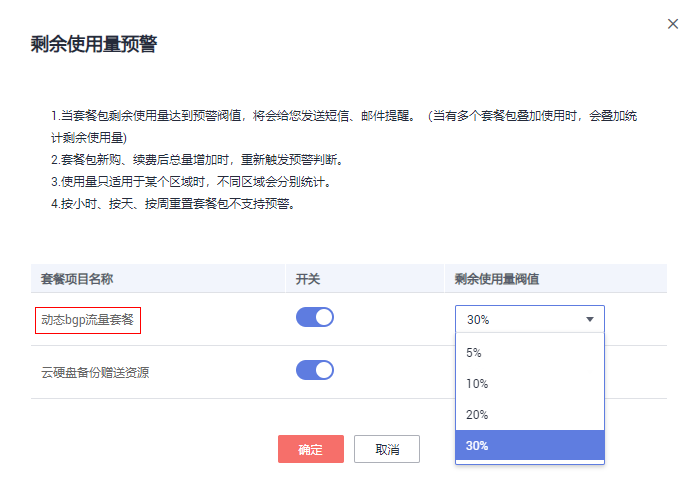

# 配置剩余使用量预警

## 操作场景

共享流量包支持配置剩余使用量预警功能。当共享流量包剩余使用量达到配置的预警阈值时，系统将会给您发送短信、邮件提醒。

共享流量包的剩余使用量预警功能可以帮助您在剩余流量达到设置的预警阈值时收到通知，及时按照需求购买共享流量包，避免因共享流量包使用完产生较高的流量费。例如，您购买的共享流量包的规格为10GB，设置的剩余使用量阈值为10%，则当您的共享流量包中剩余的流量为1GB时，系统会给您发送短信、邮件提醒。

## 操作步骤

1.  登录管理控制台。
2.  选择“资源 \> 我的套餐”。
3.  单击页面右上角的“剩余使用量预警”，可以开启并配置对应套餐包的使用量预警功能。

    **图 1**  剩余使用量预警  
    

4.  单击“确定”。

